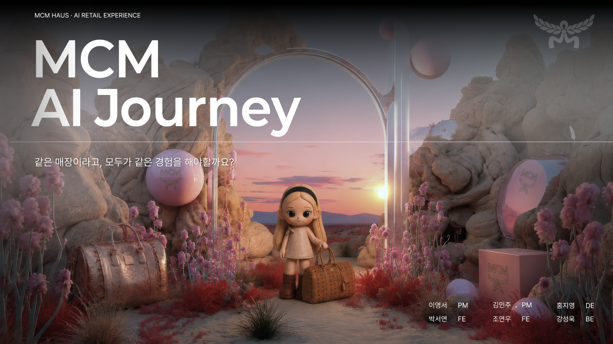

# MCM AI Journey — Frontend

> 고객보다 한발 먼저 취향을 이해하고, 다음 방문까지 기억하는 Interactive Retail Experience



MCM HAUS 청담의 오프라인 쇼핑 경험을 온라인과 연결하는 프론트엔드 프로토타입입니다. 

고객의 탐색과 AR 피팅 과정에서 발생하는 선택을 하나의 쇼핑 여정으로 연결하고, 그 결과를 Personalized Avatar와 Digital Closet으로 남겨 고객마다 다른 쇼핑 경험을 개인화합니다.

## Demo

- MCM Storefront: https://www.mcm-showcase.com
- AR Fitting: https://www.mcm-showcase.com/ar
- Digital Closet: https://www.mcm-showcase.com/#closet

## 서비스 배경

럭셔리 매장의 고객은 각자 다른 동선과 관심 상품을 가지고 매장을 탐색합니다. 하지만 기존의 AI 접점은 고객이 먼저 질문해야 하는 별도의 기능에 가까워 자연스러운 쇼핑 여정과 분리되는 한계가 있었습니다. 이에 새로운 AI 접점을 추가하는 대신, 고객이 이미 하고 있는 쇼핑 경험 자체를 개인화하는 방향에 집중했습니다.

MCM AI Journey는 고객에게 새로운 행동을 요구하기보다, 쇼핑 과정에서 이미 발생하는 선택을 연결합니다.

1. 고객이 AR 피팅을 시작합니다.
2. 회원 여부와 성별을 확인하고, 카메라 사용 동의를 거쳐 피팅을 진행합니다.
3. 추천 상품을 아바타에 적용해 보고, 상품 선택·해제·찜·실물 피팅 요청을 남깁니다.
4. 축적된 선택을 바탕으로 오늘의 Personalized Avatar를 완성합니다.
5. QR 코드로 결과를 온라인에서 다시 확인하고, Digital Closet에 저장합니다.
6. 다음 방문에서는 이전의 취향과 쇼핑 기록이 이어집니다.

## 주요 기능

### AR Fitting

- `/ar`에서 매장용 AR 피팅 플로우 제공
- 한국어·영어 전환
- AR 세션 생성 및 기존 회원 연결
- 회원 로그인 QR 코드 제공
- 성별 선택, 카메라 동의, 스캔 안내, 피팅, 아바타 생성 단계 제공
- 추천 상품을 아바타에 적용하고 선택 상태를 실시간으로 반영
- 상품 선택/해제, 위시리스트 추가/삭제, 실물 피팅 요청 이벤트 기록
- 고객의 행동과 취향에 맞는 Personalized Comment 제공
- 피팅 결과를 Personalized Avatar로 완성

### Personalized Avatar

- AR Fitting 과정에서 축적된 상품 선택을 기반으로 Avatar Look 생성
- 고객의 그날 쇼핑 경험을 하나의 스타일 결과로 시각화
- 생성된 Avatar를 Style Profile과 연결
- QR 코드를 통해 모바일 Digital Closet으로 전달

### Digital Closet

- `/my-closet`에서 저장된 Avatar와 쇼핑 기록 확인
- QR로 공유된 스타일 프로필을 비회원도 확인
- 로그인 후 공유 결과를 회원의 Closet에 연결
- 이전 스타일 프로필 목록 및 상세 정보 조회
- 기록 속 상품을 상품 상세 페이지로 이어서 탐색
- 공유 링크 및 스타일 프로필 상세 경로 지원

### MCM Storefront

- MCM 컬렉션 및 상품 카드 UI
- 상품 상세 페이지, 갤러리, 추천 상품, 찜/피팅 관련 UI
- 로그인 패널 및 회원 상태 유지
- 모바일 메뉴와 반응형 레이아웃

## 사용자 여정

```text
매장 방문 → AR Fitting 시작 → 회원 연결 또는 게스트 진행
        → 동의·스캔 안내 → 추천 상품 AR 피팅
        → 상품 선택/찜/실물 피팅 요청 → Personalized Avatar 생성
        → QR로 모바일 Digital Closet 접속 → Avatar 및 피팅 기록 확인
        → 회원 계정에 쇼핑 경험 저장
```

## 기술 스택

- React 19 · Vite 7 · JavaScript (ES Modules)
- `qrcode.react` — AR 피팅 결과 및 회원 연결 QR 생성
- CSS — 반응형 화면 및 단계별 인터랙션 스타일
- Vercel — 프론트엔드 배포
- REST API — 회원, AR 세션, 추천, 상호작용, Digital Closet 연동

## 실행 방법

### 요구 사항

- Node.js 18 이상
- npm
- 연결 가능한 MCM AI Journey 백엔드

### 설치 및 실행

```bash
npm install
npm run dev
```

개발 서버는 기본적으로 `http://localhost:5173`에서 실행됩니다.

### 빌드 및 배포 미리보기

```bash
npm run build
npm run preview
```

`prebuild` 단계에서 `assets/`의 정적 리소스를 `public/assets/`로 복사한 뒤 Vite 빌드를 생성합니다.

## 환경 변수

프로젝트 루트에 `.env` 파일을 만들고 다음 값을 설정합니다.

```env
VITE_API_BASE_URL=https://api.mcm-showcase.com
VITE_PUBLIC_APP_URL=https://www.mcm-showcase.com
```

| 변수 | 설명 |
| --- | --- |
| `VITE_API_BASE_URL` | 백엔드 API 서버 주소 |
| `VITE_PUBLIC_APP_URL` | QR 코드와 공유 링크에 사용할 프론트엔드 공개 주소 |

## 백엔드 연동 범위

프론트엔드는 다음 API와 통신합니다.

- `POST /api/members/login` — 회원 로그인
- `POST /api/ar-sessions` — AR 세션 생성
- `GET /api/ar-sessions/{arSessionId}` — 회원 연결 상태 확인
- `PATCH /api/ar-sessions/{arSessionId}/member` — AR 세션과 회원 연결
- `PATCH /api/ar-sessions/{arSessionId}/gender` — 피팅 성별 저장
- `GET /api/recommendations/ar-sessions/{arSessionId}/categories/{category}` — 상품 추천 조회
- `POST /api/recommendations/ar-sessions/{arSessionId}/categories/{category}/refresh` — 추천 새로고침
- `POST /api/ar-interactions` — 상품 선택, 해제, 찜, 피팅 이벤트 저장
- `POST /api/recommendations/avatar-look/{arSessionId}` — Avatar 결과 생성
- `POST /api/ar-sessions/{arSessionId}/messages/evaluate` — 세션 기반 메시지 평가
- `GET /api/my-closet?memberId={memberId}` — 회원 Closet 목록 조회
- `GET /api/my-closet/{styleProfileId}` — 스타일 프로필 조회
- `PATCH /api/my-closet/{styleProfileId}/member` — QR 결과를 회원 Closet에 저장

## 프로젝트 구조

```text
src/
├─ api/                    # 백엔드 API 모듈
│  ├─ arInteractions.js    # AR 행동 이벤트
│  ├─ arSessions.js        # AR 세션 메시지 평가
│  ├─ members.js           # 회원 로그인
│  └─ myCloset.js          # Digital Closet
├─ components/
│  ├─ ArPage.jsx           # AR 전체 단계 전환
│  ├─ FittingPage.jsx      # 추천·피팅·상호작용
│  ├─ AvatarCompletePage.jsx
│  ├─ ClosetPage.jsx       # Digital Closet 목록·상세·공유
│  ├─ ProductDetail.jsx
│  └─ LoginPanel.jsx
├─ data/                   # 상품 및 추천 기본 데이터
├─ App.jsx                 # MCM Storefront
├─ ClosetApp.jsx           # 경로·로그인·화면 진입 제어
└─ styles.css              # 전체 스타일 및 반응형 레이아웃
```

## 주요 경로

| 경로 | 화면 |
| --- | --- |
| `/` | MCM Storefront |
| `/ar` | AR Fitting 시작 및 피팅 플로우 |
| `/my-closet` | 나의 Digital Closet |
| `/my-closet/{styleProfileId}` | 스타일 프로필 상세 |
| `/my-closet/share/{styleProfileId}` | QR 공유 스타일 프로필 |

Vercel의 SPA rewrite를 적용해 새로고침이나 직접 접근 시에도 위 경로가 `index.html`로 연결되도록 설정했습니다.

## 해커톤에서 제안하는 가치

MCM AI Journey는 AI를 고객에게 한 번 더 설명하는 기능으로 추가하지 않습니다. 고객의 자연스러운 쇼핑 행동을 읽고, 그 행동을 현재의 추천과 반응, 그리고 다음 만남의 기억으로 연결합니다.

고객에게는 “나를 이해하는 매장”을, 브랜드에는 고객의 취향과 관계가 축적되는 새로운 리테일 접점을 제공합니다.

## TEAM

| 역할 | 담당 |
| --- | --- |
| Product Manager | 이영서, 김민주 |
| Designer | 홍지영 |
| Frontend | 박서연, 조연우 |
| Backend | 강성욱 |
